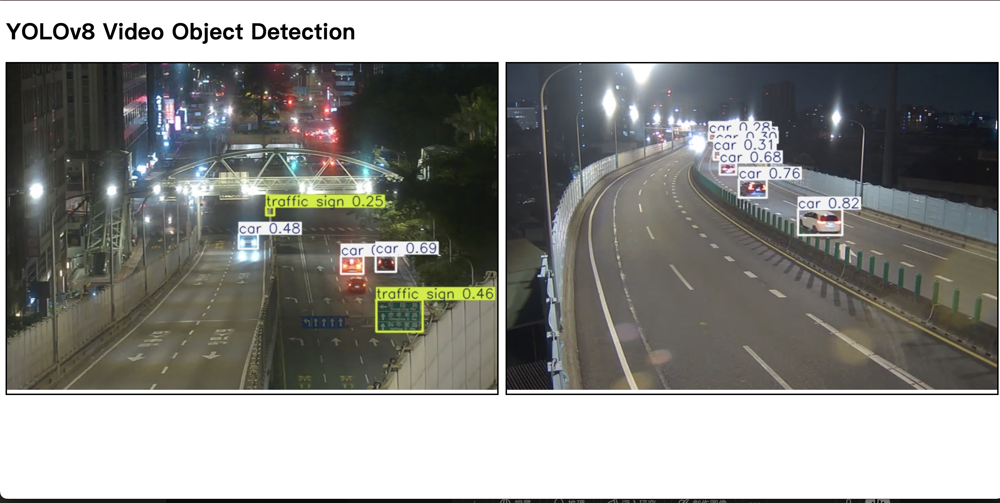

# Real-Time-Traffic-Object-Detection

This project implements Real-Time Traffic Object Detection using the YOLOv8 model for detecting various objects in traffic video streams. It leverages government monitor live streams for real-time analysis.

## Technologies Used:

#YOLOv8, #Flask, #OpenCV, #Multithreading, #MJPEGStreaming, #Python, #ObjectDetection, #RealTimeDetection

## Dataset

The dataset used for training the model is BDD100K, a large-scale dataset of driving scenes, with 100K images that are annotated with different object classes.

You can download the dataset [here](https://datasetninja.com/bdd100k#download).

#### Dataset Extraction:

```bash
tar xvf traffic.tar
```

#### Dataset Structure

The dataset follows the below directory structure:

```bash
dataset-ninja/
├── train/
│   ├── ann/        # Annotation files for training (e.g., .xml, .txt, .json)
│   └── img/        # Image files for training (e.g., .jpg, .png)
├── val/
│   ├── ann/        # Annotation files for validation
│   └── img/        # Image files for validation
```

## Preprocessing

The dataset needs to be preprocessed to match the YOLOv8 input format. The provided script performs this conversion.

```bash
python preproess.py

```

#### Processed Dataset Structure:

After preprocessing, the dataset will be in the following format:

```bash
datasets/
├── images/
│   ├── train/
│   └── val/
├── labels/
│   ├── train/
│   └── val/
```

## Model Training

We use the YOLOv8n (Nano) model for training on the preprocessed dataset. YOLOv8 is an efficient, state-of-the-art object detection model optimized for real-time applications.

#### Traffic YAML Configuration

The traffic.yaml file is a configuration file for the dataset, which specifies the dataset path, number of classes (nc), and their names.

Here is the content of the traffic.yaml file:

```yaml
path: traffic
train: images/train
val: images/val

nc: 10
names: 'bike', 'bus', 'car', 'motor', 'person', 'rider', 'traffic light', 'traffic sign', 'train', 'truck'

```

Instructions: Move the traffic.yaml file to the datasets/ directory.

```bash
mv traffic.yaml datasets/
```

#### Training Command:

```bash
yolo detect train model=yolov8n.pt data=datasets/traffic/traffic.yaml epochs=50 imgsz=640
```

## Deployment

#### Optimizations:

- Threading: To handle multiple video streams without blocking the server, each video stream is processed in a separate thread.
- MJPEG Streaming: The server used MJPEG format for streaming annotated frames in real-time.
- Frame Buffering: Frames were processed and stored in a shared buffer, and the Flask routes simply fetched the latest frame for display.

```
python app.py
```

services running on http://localhost:5000

## Demo

1. 信義區 036-市民快正氣橋上層即時影像'
2. 信義區 031-市民快永吉即時影像


